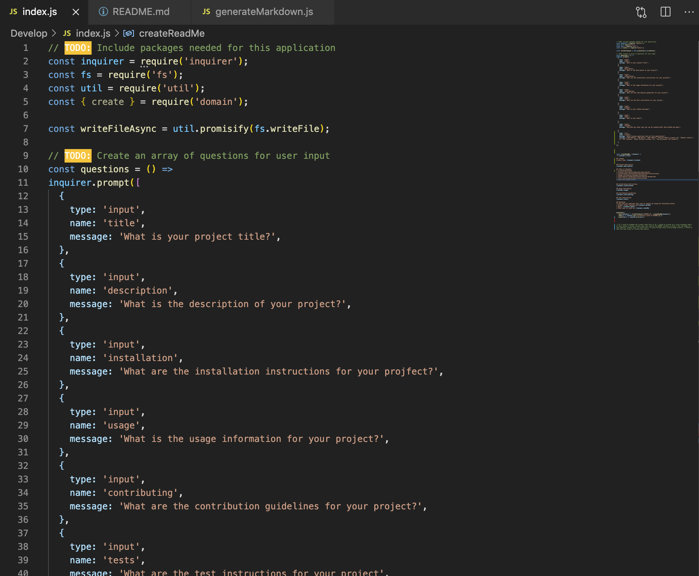
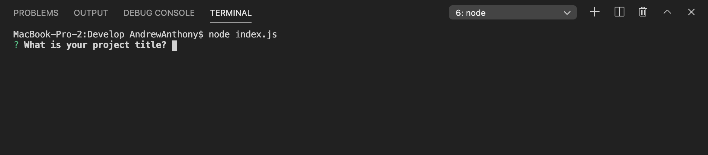
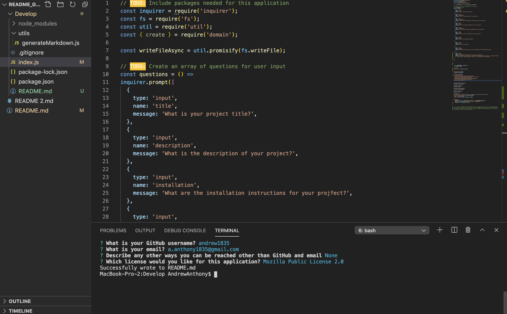
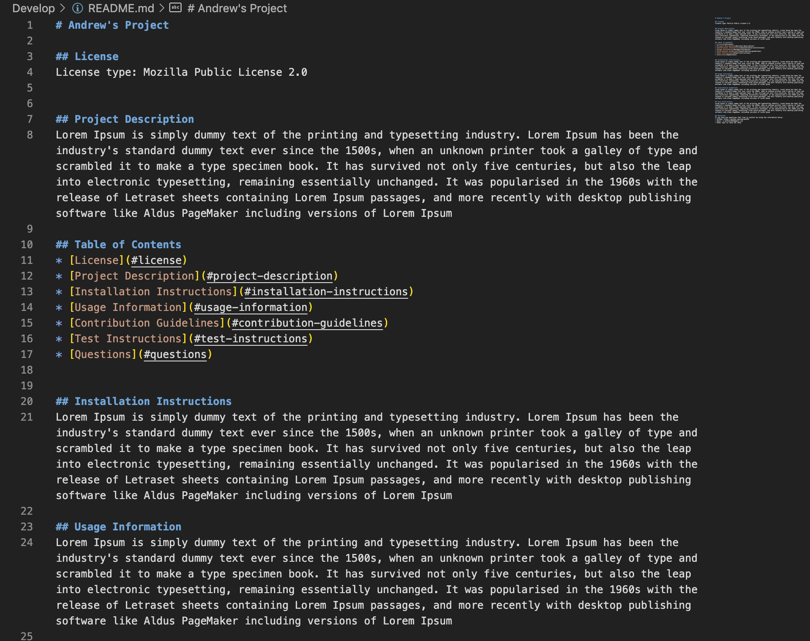
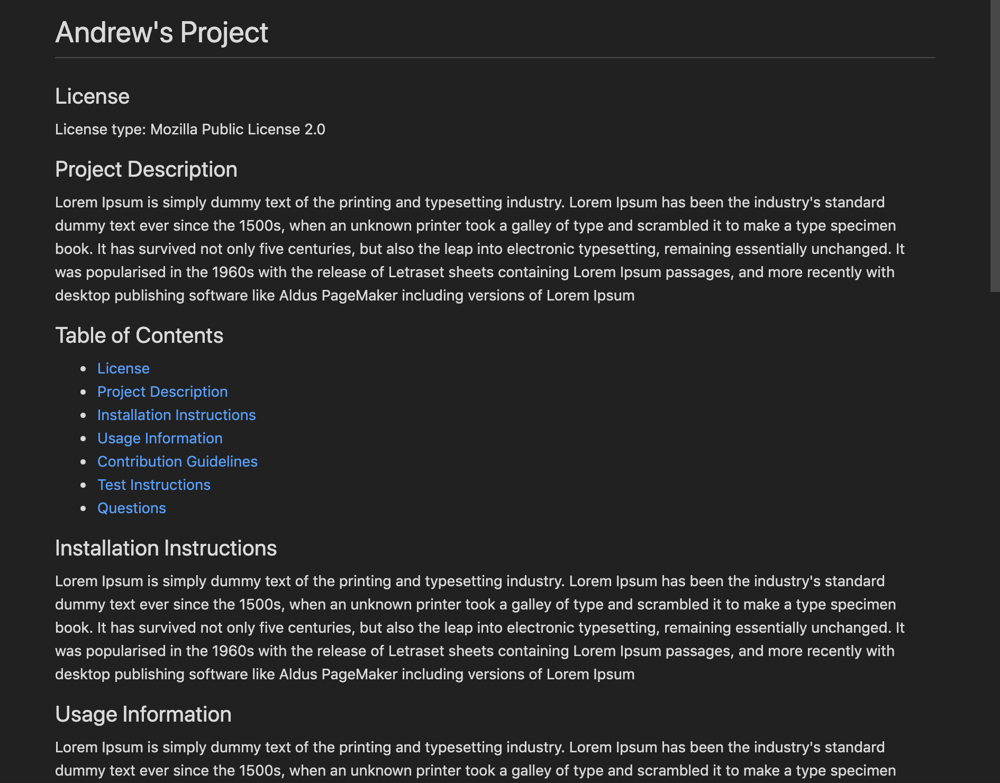

# README.md Generator

## What , Why, and How
With this assignment, I was motivated to put my newfound skills with Node to the test. I wanted to see if I could dynamically create a README file based simply off of user input in Node. It was difficult at times, but I think I really came through in all but one area: inserting license badges and license information. The specific problem I ran up against was not knowing how to deconstruct the object that housed the user selection for license. Although we went over object deconstruction in class, we never learned how to deconstruct an object that has an npm method inside of it (in this case, that npm was inquirer). I couldn't figure out how to grab that user input in JS, and thus, I couldn't. At the bottom of my JS file, I have a comment describing how I would've put the license badge and the relevant license description into the README if I knew how to grab that input. 
In order to complete this assignment to the best of my ability, I:
1. Upon the user typing in "node index.js" in to the terminal, I prompted the user with all the relevant questions to construct a README
2. I then used that information to create a README.md file, and pushed the user input onto that file
3. I created sections and a table of contents within the file for easy navigation

The assignment was straightforward, and I think that inputting the correct license badge and license description onto the page would be pretty straightforward as well if I knew how to grab that user input. I will ask a TA in office hours or I will ask my tutor for further help. 

# Links
Link to GitHub repo: https://github.com/andrew1835/ReadME_Generator

# Screen Capture
Screen Capture link: <a href="https://drive.google.com/file/d/1FBGryhANBHzmr5CrTGVGtjA5iKdf5ng2/view" target = "_blank">Click Here</a>

# Screenshots
This first screenshot is a sample of some of the code I used to write this program:

 

This second screenshot shows what happens right after you type "node index.js" into the integrated terminal: 

 

This third screenshot shows what happens when you finish answering the questions in the integrated terminal. You can see that a new README file has appeared in the top left: 

 

This fourth screenshot is a sample that shows the content of the README file that has been created based off user input: 

 

This final screenshot shows what the README file looks like when viewed in Preview:

